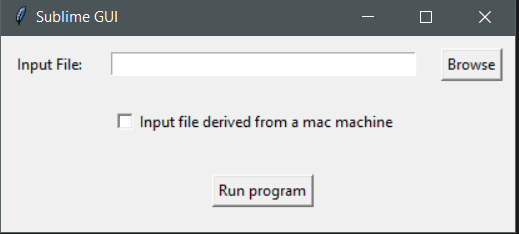
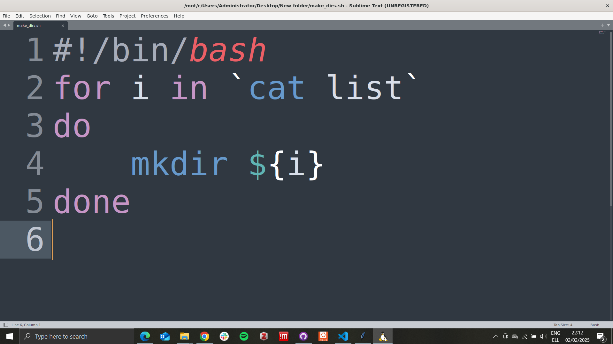
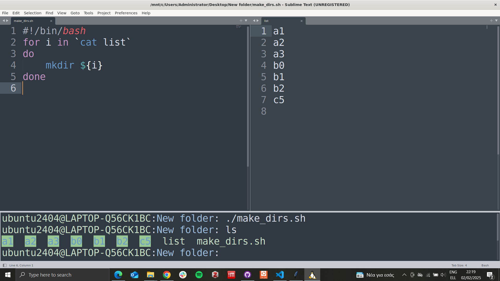

# sublime_gui
A windows lightweight GUI app to navigate via the windows filesystem, open and run files using sublime-text in windows subsystem for linux

## Installation
1. Install the [windows subsystem for linux](https://github.com/BioGUIwslLab/WSL-Installation/blob/main/README.md)
2. Install [dos2unix](https://ioflood.com/blog/install-dos2unix-command-linux/) based on your linux distribution.
3. Install [Sublime Text](https://www.sublimetext.com/docs/linux_repositories.html) on windows subsystem for linux.
4. If you wanna run files through the terminal install [terminus](https://www.geeksforgeeks.org/how-to-use-terminal-in-sublime-text-editor/) in Sublime Text.
5. Make file extensions appear on [windows](https://www.howtogeek.com/205086/beginner-how-to-make-windows-show-file-extensions/)
6. Download the `sublime_gui.exe` from the `bin` folder.

## Usage
1. Go to the folder your are going to work on and with right click, select New -> Text Document. Rename the file and change the extension if needed. lets say we change it to .sh that we are going to run.

2. Open `sublime_gui.exe` click `Browse` and navigate to the file you just created.



3. Click `Run program`. A Sublime Text window will appear

4. type the code of your choice:



5. Close the window.

6. Repeat the same process to create the `list` file

7. Reopen the `.sh` file with `sublime_gui.exe`

8. Type `Alt + 1`

9. Convert to executable by typing in the terminal:

```bash
chmod +x make_dirs.sh
```

10. Run the executable:

```bash
./make_dirs.sh
```



